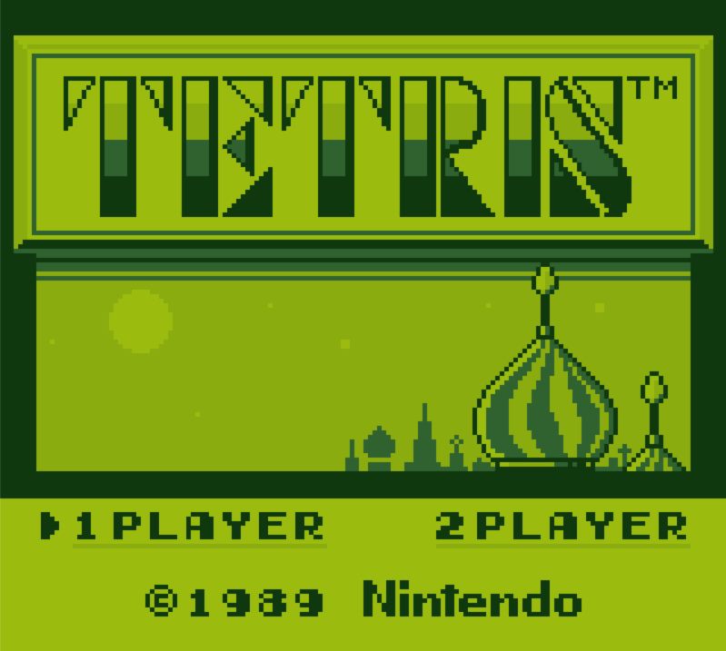
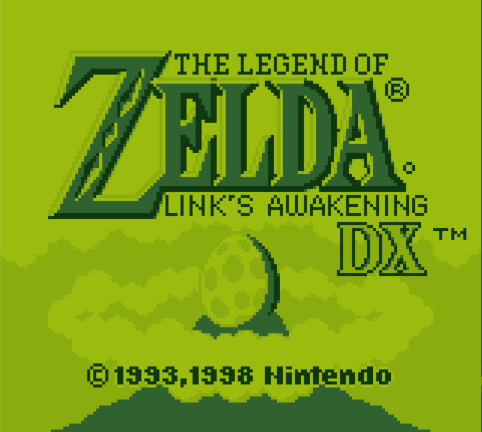

# PyDMG 🎮🔥

[](https://deepwiki.com/Santitub/PyDMG) [](https://www.python.org/downloads/) [](https://opensource.org/licenses/MIT) []()

Un emulador de **Game Boy Classic** de alto rendimiento escrito en Python y optimizado con Cython para lograr velocidad de juego completa con precisión de ciclo.

---

## ⚡ Rendimiento

| Modo | Python Puro | Con Cython | Speedup |
| :--- | :--- | :--- | :--- |
| **Normal** | ~20 FPS | **~60 FPS** | **3x** |
| **Turbo** | ~5 FPS | **~50 FPS** | **10x** |

*Benchmarks en Intel Core i5-1135G7 @ 2.40GHz. El turbo mode ejecuta 4 frames por ciclo.*

---

## 🎯 Características Principales

- **🎮 Emulación Precisa**: Timing de CPU por ciclo, PPU con modos de renderizado exactos
- **⚡ Rendimiento Extremo**: Optimizado con Cython, SIMD AVX2 y Link-Time Optimization
- **🔊 Audio de Calidad**: 4 canales (Pulse, Wave, Noise) a 22.050Hz stereo
- **💾 Save States**: 10 slots con compresión zlib (F5/F7)
- **🎨 Paletas de Color**: 4 paletas integradas (DMG, Verde, Gris, Pocket)
- **📀 Soporte MBC**: ROMs sin MBC, MBC1, MBC2, MBC3 (con RTC), MBC5
- **💾 SRAM con Batería**: Guardado automático de partidas (.sav)
- **🚀 Modo Turbo**: Ejecuta hasta 4x velocidad (mantén ESPACIO)
- **🛠️ CPU Auto-Detect**: Se adapta automáticamente a tu procesador

---

## 📦 Requisitos

```txt
PySDL2>=0.9.14
numpy>=1.19.0
cython>=0.29.0
pysdl2-dll>=2.0.0  # Para Windows (SDL2 precompilado)
py-cpuinfo>=9.0.0
setuptools>=58.0.0
```

---

## 🔧 Instalación

### Linux / macOS

```bash
# 1. Clonar repositorio
git clone https://github.com/Santitub/pydmg.git
cd pydmg

# 2. Instalar dependencias
pip install -r requirements.txt

# 3. Compilar extensiones Cython (crítico para rendimiento)
python setup.py build_ext --inplace

# 4. Ejecutar
python main.py roms/tetris.gb
```

### Windows

```powershell
# 1. Clonar
git clone https://github.com/Santitub/pydmg.git
cd pydmg

# 2. Instalar dependencias (incluye SDL2 precompilado)
pip install -r requirements.txt

# 3. ⚠️ INSTALAR COMPILADOR C++ (PASO OBLIGATORIO)
#    Descarga "Visual Studio Community" e instala:
#    "Desarrollo para el escritorio con C++"
#    Incluye: MSVC, CMake y herramientas de Windows para C++
#    Link: https://visualstudio.microsoft.com/visual-cpp-build-tools/

# 4. Compilar
python setup.py build_ext --inplace

# 5. Ejecutar
python main.py roms\tetris.gb
```

> **⚠️ IMPORTANTE**: En Windows, **DEBES** instalar las herramientas de C++ de Visual Studio antes de compilar Cython. Sin ellas, la compilación fallará con errores de "vcvarsall.bat no encontrado".

> **⚠️ RENDIMIENTO**: Sin la compilación Cython, el rendimiento será ~20 FPS. La compilación habilita optimizaciones AVX2 y LTCG automáticamente según tu CPU.

---

## 🎮 Controles

### Controles del Juego
| Tecla | Botón GB |
| :--- | :--- |
| `↑↓←→` | D-Pad |
| `Z` / `A` | A |
| `X` / `S` | B |
| `Enter` | Start |
| `Shift` | Select |

### Controles del Emulador
| Tecla | Función |
| :--- | :--- |
| `F1` | Mostrar ayuda |
| `P` | Pausar/Continuar |
| `C` | Cambiar paleta de color |
| `M` | Silenciar/Activar audio |
| `R` | Resetear juego |
| `D` | Modo debug (FPS log) |
| `Space` | **Turbo (mantener)** |
| `ESC` | Salir |
| **Save States** | |
| `F5` | Guardar estado |
| `F7` | Cargar estado |
| `F6` / `F8` | Slot anterior/siguiente |
| `0-9` | Seleccionar slot directo |

---

## 🚀 Compilación Avanzada

### Modos de Compilación

El `setup.py` detecta automáticamente tu CPU y aplica flags optimizados:

```bash
# Compilación estándar (detecta CPU automáticamente)
python setup.py build_ext --inplace

# Mantener archivos C intermedios (para debug)
KEEP_CYTHON_FILES=1 python setup.py build_ext --inplace

# Para distribución (compatibilidad máxima)
python setup.py build_ext --inplace --force-compat
```

### Flags por CPU

| CPU | Flags Aplicados | Rendimiento |
| :--- | :--- | :--- |
| **Moderna** (AVX2) | `/arch:AVX2`, `-march=native`, LTO, unroll loops | ⭐⭐⭐⭐⭐ |
| **Antigua** (Genérico) | `/O2`, `-march=x86-64`, tune genérico | ⭐⭐⭐ |

---

## 🏗️ Arquitectura Técnica

```
┌─────────────────────────────────────────┐
│           main.py (SDL2 Frontend)       │
└─────────────────┬───────────────────────┘
                  │
┌─────────────────▼───────────────────────┐
│         GameBoy (Orchestrator)          │
├───────────┬───────────┬───────────┬─────┤
│  CPU      │  PPU      │  APU      │ MMU │
│  (LR35902)│  (LCD)    │  (Audio)  │     │
└───────────┴───────────┴───────────┴─────┘
     ▲           ▲          ▲           │
     │           │          │           ▼
┌────┴─────┐ ┌───┴────┐ ┌──┴────┐ ┌─────┴────────┐
│  Timer   │ │ Window │ │ SDL2  │ │ MBC1/2/3/5   │
│          │ │ Sprites│ │ Queue │ │ SRAM .sav    │
└──────────┘ └────────┘ └───────┘ └──────────────┘
```

### Componentes Core

- **CPU**: Dispatch table de 256 handlers, timing por M-cycle, HALT bug implementado
- **PPU**: Memoryviews de Cython, renderizado scanline, 4 modos exactos
- **APU**: Generación por lotes, 4 canales, buffer de 512 samples, SDL_QueueAudio
- **MMU**: MBC completo, batería SRAM, DMA, memoria conectada
- **Timer**: Div preciso por ciclo, 4 frecuencias seleccionables

---

## 🎨 Ejemplos de Paletas

| Paleta | Previsualización | Uso |
| :--- | :--- | :--- |
| **dmg** | 🟫🟩🟩🟫 | Clásico Game Boy |
| **green** | 🟩🟩🟩🟩 | Pantalla verde original |
| **gray** | ⬜⬜⬜⬜ | Escala de grises pura |
| **pocket** | ⬜⬜⬜⬜ | Game Boy Pocket |

## 🛠️ Desarrollo

```bash
# Instalar en modo editable
pip install -e .

# Ejecutar tests (si los hay)
pytest tests/

# Perfilado de rendimiento
python -m cProfile -o profile.stats main.py rom.gb
```

---

## [📄 Licencia](LICENSE)

## 📸 Capturas de Pantalla


*Classic Tetris corriendo a 60 FPS*


*The Legend of Zelda: Link's Awakening DX*

---

**⭐ Si te gusta este proyecto, ¡dale una estrella en GitHub!**
